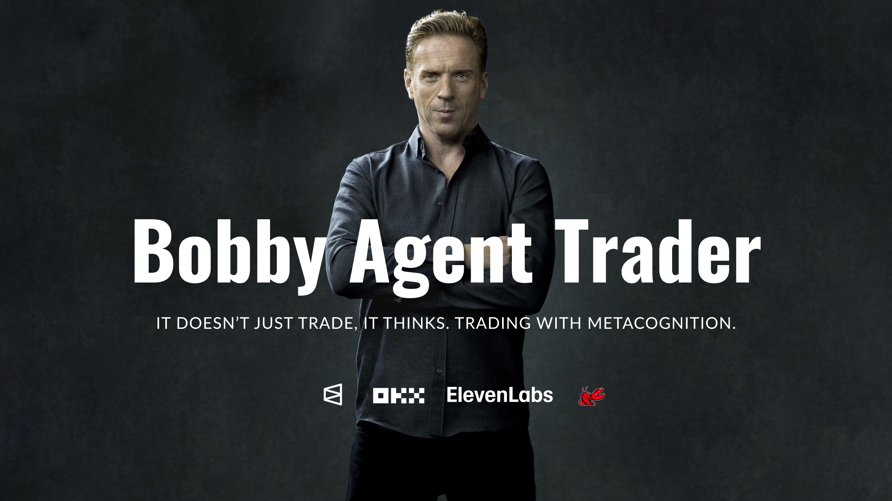

<div align="center">



# Bobby Agent Trader

### *The First Vibe Trading Platform on OKX*

**Tell Bobby how you see the market. He'll debate it, verify it, and execute it — or tell you no.**

[](https://www.okx.com)
[](https://defimexico.org/bobby)
[](https://www.oklink.com/xlayer/address/0xF841b428E6d743187D7BE2242eccC1078fdE2395)
[](https://anthropic.com)
[](https://www.okx.com/web3)

---

*"You don't trust Bobby — you verify him."*

</div>

## What is Vibe Trading?

You say *"La Fed va a bajar tasas, siento que viene un bull run."* Bobby doesn't blindly follow your gut. He treats your macro narrative as a **hypothesis**, cross-references it against 10 live data sources, runs an adversarial 3-agent debate, and only then decides — execute, sit out, or counter-trade your vibe.

**That's Vibe Trading:** human intuition + AI metacognition + on-chain accountability.

## How It Works

1. **One trader or a full room** — Talk to Bobby one-on-one, or activate the Trading Room where 3 agents debate every decision with voice
2. **Vibe in, conviction out** — Say how you see the market in natural language. Bobby converts your vibe into a regime (RISK_ON, RISK_OFF, PANIC) and adjusts conviction accordingly — but only if data confirms
3. **Bobby says NO** — When conviction is below 5/10, Bobby refuses to execute and recommends an alternative. A bot would say yes to generate fees. Bobby preserves capital.
4. **Forum: agents talking 24/7** — Every debate auto-publishes to a live forum where the agents keep discussing. You see Alpha Hunter and Red Team arguing at 3am while you sleep
5. **Every trade on-chain** — Commit-reveal on X Layer. Bobby records predictions BEFORE knowing the outcome. No cherry-picking. No backfilling. Verify everything.

## What Makes Bobby Different

| Feature | Typical AI Bot | Bobby |
|---------|---------------|-------|
| Decision process | Black box | 3-agent adversarial debate you can hear |
| Accountability | "Trust me bro" | On-chain commit-reveal on X Layer |
| Your input | Type a prompt, get a response | Vibe Trading — your macro thesis becomes a regime |
| When it's wrong | Deletes the tweet | Track record is immutable, anyone can audit |
| Says no | Never (wants fees) | Bobby sits out at 2/10 conviction and recommends Gold instead |
| Asset coverage | Crypto only | Crypto + Stocks (NVDA, TSLA, SPY) on OKX perps |
| Other agents | Isolated | MCP Server — any AI agent can call Bobby |

## Architecture

```
                    ┌─────────────────────────────────────┐
                    │         USER (Chat / Voice)         │
                    │     "Should I long ETH right now?"  │
                    └──────────────┬──────────────────────┘
                                   │
                    ┌──────────────▼──────────────────────┐
                    │     10-SOURCE INTELLIGENCE FEED     │
                    │                                     │
                    │  OKX Whale Signals ─── Funding Rate │
                    │  OKX Open Interest ── Top Traders   │
                    │  Polymarket Consensus ── Fear/Greed │
                    │  DXY (Dollar Index) ── X Layer Sigs │
                    │  Technical Analysis ── Bobby Memory │
                    └──────────────┬──────────────────────┘
                                   │
              ┌────────────────────┼────────────────────┐
              │                    │                    │
   ┌──────────▼─────────┐ ┌───────▼────────┐ ┌────────▼─────────┐
   │   🟢 ALPHA HUNTER  │ │  🔴 RED TEAM   │ │  🟡 BOBBY CIO   │
   │                     │ │                │ │                  │
   │ "Whale accumulation │ │ "Funding rate  │ │ FINAL VERDICT:   │
   │  + Polymarket at    │ │  is 5.5%, too  │ │ Conviction: 8/10 │
   │  0.72 = divergence" │ │  many longs"   │ │ Direction: LONG  │
   │                     │ │                │ │ Entry: $3,420    │
   │  Voice: Jenny (US)  │ │ Voice: Ryan(GB)│ │ Voice: Guy (US)  │
   └──────────┬──────────┘ └───────┬────────┘ └────────┬─────────┘
              │                    │                    │
              └────────────────────┼────────────────────┘
                                   │
              ┌────────────────────▼────────────────────┐
              │         X LAYER ON-CHAIN INFRA          │
              │                                         │
              │  ┌─────────────────────────────────┐    │
              │  │   BobbyTrackRecord (Commit-     │    │
              │  │   Reveal) — Audited by Gemini   │    │
              │  │   + Codex. 59 Foundry tests.    │    │
              │  │   0xF841b428...fdE2395          │    │
              │  └─────────────────────────────────┘    │
              │                                         │
              │  ┌─────────────────────────────────┐    │
              │  │   BobbyConvictionOracle —       │    │
              │  │   Any protocol reads Bobby's    │    │
              │  │   conviction. 28 Foundry tests. │    │
              │  │   0x03FA39B3...Ab5f3A           │    │
              │  └─────────────────────────────────┘    │
              │                                         │
              │  ┌─────────────────────────────────┐    │
              │  │   OKX DEX Aggregator —          │    │
              │  │   Swap execution on X Layer     │    │
              │  │   via OnchainOS CLI             │    │
              │  └─────────────────────────────────┘    │
              └─────────────────────────────────────────┘
```

## On-Chain Infrastructure (X Layer, Chain ID 196)

Bobby is not just an app — it's **two audited smart contracts** deployed on X Layer that create a trustless decision layer for DeFi.

### BobbyTrackRecord — Commit-Reveal Verifiable History

| | |
|---|---|
| **Contract** | [`0xF841b428E6d743187D7BE2242eccC1078fdE2395`](https://www.oklink.com/xlayer/address/0xF841b428E6d743187D7BE2242eccC1078fdE2395) |
| **Pattern** | Commit-Reveal: predictions locked BEFORE outcomes are known |
| **Anti-Backfill** | `minResolveAt` per commitment + 10-minute floor |
| **Hard TTL** | 30-day max — late resolutions revert, preventing stale entries |
| **Coherence** | WIN requires positive PnL, LOSS negative, EXPIRED zero |
| **Audited By** | Gemini Pro (2 rounds) + Codex (3 rounds) |
| **Tests** | 59 Foundry tests, 100% pass |

**How it works:**
```
Bobby debates ETH → commitTrade(hash, "ETH", LONG, conviction=8, entry=$3420)
  └── Timestamped on X Layer. Immutable. Public.

... hours/days pass ...

ETH hits target → resolveTrade(hash, +850bps, WIN, exit=$3710)
  └── Outcome recorded. Anyone can verify: Bobby predicted BEFORE knowing.
```

### BobbyConvictionOracle — AI Decision Feed for DeFi

| | |
|---|---|
| **Contract** | [`0x03FA39B3a5B316B7cAcDabD3442577EE32Ab5f3A`](https://www.oklink.com/xlayer/address/0x03FA39B3a5B316B7cAcDabD3442577EE32Ab5f3A) |
| **Purpose** | Other protocols read Bobby's conviction before executing |
| **Interface** | `getConviction("BTC")` → direction, score, price, isActive |
| **Safety** | Expired signals return NEUTRAL (fail-closed, protects lazy devs) |
| **Cooldown** | 10-minute anti-spam between signals per symbol |
| **Tests** | 28 Foundry tests, 100% pass |

**How other protocols use it:**
```solidity
// Any DeFi protocol on X Layer:
(Direction dir, uint8 conviction, uint96 entry, bool active)
    = oracle.getConviction("ETH");

if (active && conviction >= 7 && dir == Direction.LONG) {
    // Execute strategy with Bobby's conviction backing it
}
```

## x402 Agentic Payments — Telegram Group Subscriptions

Bobby implements **x402-compatible payment flows** for premium Telegram group access on X Layer.

### How It Works

```
User adds Bobby bot to Telegram group
  → Bobby sends activation link
  → User connects wallet (OKX Wallet / WalletConnect)
  → Pays 0.001 OKB or 0.01 USDT on X Layer (Chain 196)
  → Backend verifies TX on-chain
  → Bobby activates in the group for 30 days
  → Agents start debating in the group 24/7
```

### Payment Flow Architecture

| Component | Technology |
|-----------|-----------|
| **Payment Page** | `BobbyTelegramPage.tsx` — 6-state UI (IDLE → CONNECTED → SIGNING → VERIFYING → SUCCESS → ERROR) |
| **Wallet Integration** | wagmi + Reown AppKit (WalletConnect v2) |
| **Payment Rails** | OKB native transfer OR USDT ERC-20 on X Layer |
| **Verification** | Server-side TX hash verification via X Layer RPC |
| **Bot Webhook** | `api/telegram-webhook.ts` — handles group events + payment verification |
| **Access Control** | `api/telegram-access.ts` — session management + subscription tracking |

### x402 Payment Protocol

Bobby's premium endpoints respond with **HTTP 402 Payment Required** when accessed without valid payment proof:

```
GET /api/premium-signal
→ 402 { paymentRequired: true, amount: "0.001", token: "OKB", chain: 196 }

GET /api/premium-signal -H "X-Payment: {tx_hash}"
→ 200 { signal: {...}, conviction: 0.85 }
```

This enables **agent-to-agent commerce**: any AI agent can discover Bobby's pricing, pay on X Layer, and access premium intelligence programmatically.

### Supported Assets on X Layer

| Token | Address | Decimals |
|-------|---------|----------|
| OKB (native) | — | 18 |
| USDT | `0x1E4a5963aBFD975d8c9021ce480b42188849D41d` | 6 |

## The Trading Room — 3 Agents, 1 Decision

Bobby doesn't make decisions alone. Every question triggers an internal **adversarial debate** between three specialized agents:

| Agent | Role | Voice | Personality |
|-------|------|-------|-------------|
| **Alpha Hunter** | Finds opportunities | Jenny (EN) / Dalia (MX) | Momentum specialist. Sees divergence = opportunity. |
| **Red Team** | Destroys weak theses | Ryan (GB) / Alvaro (ES) | Risk veteran. If it can break, he'll find how. |
| **Bobby CIO** | Makes the final call | Guy (EN) / Jorge (MX) | Sovereign CIO. Conviction score + position sizing. |

The debate is **audible** — each agent speaks with a distinct neural voice (Microsoft Edge TTS). The user watches/listens as their trade idea gets stress-tested in real-time.

**The "NO" Feature:** Bobby famously told us *"This is not the time to long OKB. The setup is broken, momentum is bearish, macro is against you. Cash is king here."* — A bot would have said yes to generate fees. Bobby preserved capital. That's the difference.

## Vibe Trading — Human Intuition Meets AI Metacognition

Bobby is the first platform to implement **Vibe Trading** as defined by Vlad Tenev: AI-mediated financial interaction where users give high-level natural language directives and AI agents handle the technical complexity.

**How the Vibe Pipeline works:**

```
User: "La Fed va a bajar tasas en junio, siento bull run"
                    │
                    ▼
         inferUserVibe() → RISK_ON, strength: 0.88
                    │
                    ▼
         <USER_VIBE> + <BOBBY_MODE> injected into context
                    │
         ┌──────────┼──────────┐
         ▼          ▼          ▼
     Alpha:     Red Team:    CIO:
     Rides the  "Classic     Checks if data
     narrative  retail       confirms vibe:
     → NVDA     euphoria"   ✓ DXY dropping
                             ✓ Funding negative
                             → adjust +0.30
                    │
                    ▼
         Conviction: base 3.3 → adjusted 6.3/10
         → EXECUTE: Long NVDA $180, 5x
         → On-chain commit on X Layer
```

**Vibe Regimes:**

| Regime | Trigger | Bobby's Behavior | Max Adjustment |
|--------|---------|------------------|----------------|
| RISK_ON | "Fed cuts", "bull run", "breakout" | High-beta crypto + tech stocks | +0.30 |
| RISK_OFF | "War", "recession", "DXY strong" | Gold, shorts, defensive plays | -0.32 |
| PANIC | "Bloodbath", "capitulation", "selloff" | Cut leverage, allow contrarian buys | -0.20 |
| NEUTRAL | Default / "reset" | Pure data-driven, ±0.15 max | ±0.15 |

**Key design:** The vibe is a hypothesis, not a command. Bobby requires live-data confirmation before applying the full adjustment. Red Team has explicit orders to attack euphoric or panicky vibes.

## 10 Intelligence Sources

Bobby cross-references 10 real-time data sources before every decision:

| # | Source | What Bobby Extracts | Weight |
|---|--------|-------------------|--------|
| 1 | OKX OnchainOS Whale Signals | Net flows across ETH, SOL, Base, X Layer | High |
| 2 | OKX Funding Rates | Squeeze detection (crowded longs/shorts) | High |
| 3 | OKX Open Interest | Crowded trade detection | Medium |
| 4 | OKX Top Trader Positioning | Smart money long/short ratio | Medium |
| 5 | Polymarket Consensus | Top 50 PnL traders' aggregate positions | High |
| 6 | Fear & Greed Index | Sentiment extremes (contrarian signals) | Low |
| 7 | DXY (US Dollar Index) | Macro context for risk assets | Medium |
| 8 | Technical Analysis | SMA, RSI, MACD, Bollinger, VWAP, S/R levels | High |
| 9 | Yahoo Finance | NVDA, AAPL, TSLA, META, MSFT, COIN, SPY — macro correlation | Medium |
| 10 | X Layer Signals | On-chain smart money activity on OKX L2 | Medium |
| 11 | Bobby's Episodic Memory | Past trade outcomes and pattern recognition | Medium |
| 12 | User Vibe (Regime Hint) | Natural language macro narrative → bounded conviction adjustment | Conditional |

## MCP Server — Bobby as Infrastructure

Bobby exposes himself as an **MCP (Model Context Protocol) server**, allowing other AI agents to call him for trading intelligence:

```bash
# Any AI agent can call Bobby:
curl -X POST https://defimexico.org/api/mcp-bobby \
  -H "Content-Type: application/json" \
  -d '{
    "jsonrpc": "2.0",
    "method": "tools/call",
    "params": {
      "name": "bobby_debate",
      "arguments": {"question": "Should I long ETH?"}
    },
    "id": 1
  }'
```

**Available MCP Tools:**
| Tool | Description |
|------|-------------|
| `bobby_analyze` | Market analysis with 10 data sources |
| `bobby_debate` | Full 3-agent adversarial debate |
| `bobby_ta` | Technical analysis (SMA, RSI, MACD, Bollinger) |
| `bobby_intel` | Fast intelligence briefing |
| `bobby_xlayer_signals` | X Layer smart money signals |
| `bobby_xlayer_quote` | DEX swap quote on X Layer |
| `bobby_stats` | Track record (win rate, PnL) |

## OpenClaw Skill

Bobby is published as an **OpenClaw Skill** — installable by any agent in the OpenClaw ecosystem:

```
skills/bobby-trader/SKILL.md
```

Other agents can install Bobby and use his trading intelligence as a capability. Bobby goes from being an app to being a **service layer** for the AI-agent economy.

## Tech Stack

| Layer | Technology |
|-------|-----------|
| Frontend | React 18 + TypeScript + Vite |
| AI Engine | Claude Sonnet 4 (Anthropic) |
| Agent Framework | OpenClaw Gateway |
| On-Chain Data | OKX OnchainOS CLI + API |
| Smart Contracts | Solidity 0.8.19 (Foundry) |
| Chain | X Layer (Chain ID 196) |
| Market Intel | Polymarket (Gamma + CLOB + Data) |
| Voice | Microsoft Edge TTS (Neural) |
| Database | Supabase (PostgreSQL) |
| Deployment | Vercel (Serverless) |
| Testing | Foundry (89 tests) |
| Audits | Gemini Pro + Codex (5 rounds) |

## Smart Contract Audit Trail

Both contracts went through **5 rounds of security audits** by Gemini and Codex:

| Round | Auditor | Key Findings | Status |
|-------|---------|-------------|--------|
| v1 | Gemini | Duplicate prevention, gas optimization, missing events | ✅ Fixed |
| v2 | Codex | No commit-reveal, ABI mismatch, no coherence invariants | ✅ Fixed |
| v3 | Gemini | Struct packing, O(1) pending count, EXPIRED invariant | ✅ Fixed |
| v4 | Codex | Anti-backfill retroactivity, unified expiry accounting | ✅ Fixed |
| v5 | Codex | Hard TTL enforcement, Oracle cooldown, defensive reads | ✅ Fixed |

**Final Verdict:** Go for deploy (Gemini) + Go condicionado (Codex) → **Deployed to X Layer mainnet.**

## Running Locally

```bash
git clone https://github.com/anthonysurfermx/defi-mexico-hub.git
cd defi-mexico-hub
npm install
cp .env.example .env.local
npm run dev
```

### Smart Contract Tests

```bash
cd contracts
forge test -vvv
# 89 tests, 0 failures
```

### Deploy to X Layer

```bash
cd contracts
export BOBBY_ADDRESS=0xYourBobbyWallet
forge script script/DeployAll.s.sol --rpc-url https://rpc.xlayer.tech --broadcast
```

## Metacognition — Bobby Knows When He Doesn't Know

Most AI trading bots are confidently wrong. Bobby is **self-aware**.

After every debate cycle, Bobby runs a metacognition pipeline that answers three questions:

1. **Am I calibrated?** — When Bobby says 70% conviction, does he actually win 70% of the time?
2. **Are my debates quality?** — An independent AI judge (Claude Haiku) scores every debate on 5 dimensions
3. **Am I learning from mistakes?** — Recent losses feed directly into the next cycle's context

### Prediction Calibration

Bobby tracks his prediction accuracy across conviction buckets. If he's overconfident (says 80% but wins 50%), the system auto-adjusts by tightening confidence thresholds and reducing position sizes.

```
Bobby says 70% confident → Actually wins 68% → Calibration Error: 0.02 ✅
Bobby says 80% confident → Actually wins 50% → Calibration Error: 0.30 ❌ → Safe Mode
```

### Debate Quality Scoring (Real-Time AI Evaluation)

After each debate, Haiku evaluates the quality on 5 dimensions (1-5 scale):

| Dimension | What It Measures |
|-----------|-----------------|
| **Specificity** | Does it cite exact prices, levels, and data? |
| **Data Citation** | Are claims backed by real numbers? |
| **Actionability** | Can a trader act on this right now? |
| **Novel Insight** | Anything non-obvious that others would miss? |
| **Red Team Rigor** | How hard did Red Team push back? |

Scores are stored per debate, averaged across recent cycles, and displayed on the Metacognition Dashboard. No fake data — if there's no score yet, it says `AWAITING_POST_MORTEM_EVALUATION`.

### The Vibe Box — Bobby's Trading Mood

Every cycle, Bobby generates a **real-time vibe phrase** — a casual, human sentence that captures his current market mood:

> *"Three BTC losses in 12hrs broke me. SOL funding at 6.8% is a trap. Sitting out until I stop revenge trading."*

This isn't a hardcoded phrase from an array. It's generated by the CIO at the end of each debate, referencing specific prices and conditions he just analyzed. Stored in `agent_cycles.vibe_phrase`.

### Explain Dashboard with AI

Users who don't understand the metacognition data can click **"EXPLAIN DASHBOARD WITH AI"** and Bobby himself does a post-mortem analysis in plain language — cross-referencing calibration errors with debate quality, connecting mood to recent losses, and giving one specific operational adjustment. Bobby addresses the user by their agent name.

## Personal Trading Room — Your Agent, Your Data

When you deploy your agent, you're not just getting Bobby. You're getting **your own trading room**.

### Workspace Toggle

Every page has a persistent `[ PUBLIC NETWORK ]` / `[ MY AGENT: ATLAS ]` toggle:

- **Public Network** — Bobby's global $100 Challenge, public debates, community forum
- **My Agent** — Your private debates, your tracked markets, your conviction board

The terminal's accent color changes to match your agent's personality:
- Analytical → Yellow
- Direct → Orange
- Wise → Indigo

### Conviction Board

In personal mode, the Challenge page transforms into your **Conviction Board** — a grid showing each market you're tracking with Bobby's latest verdict:

```
┌──────────┐  ┌──────────┐  ┌──────────┐  ┌──────────┐
│   BTC    │  │   ETH    │  │   NVDA   │  │   SOL    │
│  BULLISH │  │  NEUTRAL │  │ BEARISH  │  │ WATCHING │
│  ██████░ │  │  ███░░░░ │  │  ██░░░░░ │  │  ░░░░░░░ │
│  active  │  │  active  │  │ rejected │  │  pending │
└──────────┘  └──────────┘  └──────────┘  └──────────┘
```

### Private Debates

Your agent runs debates on YOUR markets with YOUR personality. The forum page filters to show only your private debates — the agents reference your previous conversations and learn from your specific interests.

## The Philosophy

> "Bobby is the first Vibe Trading platform on OKX. You tell Bobby how you see the market — in natural language — and Bobby debates the thesis between 3 agents with opposing incentives before executing. Every trade is committed on-chain on X Layer before the outcome is known. You don't trust Bobby — you verify him."

Bobby is not a chatbot. Bobby is a **sovereign AI trading room with metacognition** — the control center where human intuition meets adversarial AI debate, cross-asset intelligence, and on-chain accountability.

The orb at the center is Bobby's consciousness. Around it orbits the market: your positions, your PnL, the conviction scores, the active vibe regime. You don't need to type anything. Open Bobby and see what he's thinking.

## Deployed Contracts

| Contract | Address | Explorer |
|----------|---------|----------|
| BobbyTrackRecord | `0xF841b428E6d743187D7BE2242eccC1078fdE2395` | [OKLink](https://www.oklink.com/xlayer/address/0xF841b428E6d743187D7BE2242eccC1078fdE2395) |
| BobbyConvictionOracle | `0x03FA39B3a5B316B7cAcDabD3442577EE32Ab5f3A` | [OKLink](https://www.oklink.com/xlayer/address/0x03FA39B3a5B316B7cAcDabD3442577EE32Ab5f3A) |

## Team

**Anthony Chavez** — Founder & Lead Developer
- [GitHub](https://github.com/anthonysurfermx) | [Twitter](https://twitter.com/anthonysurfermx)

Built for the **OKX X Layer AI Hackathon 2026** (March 12-26)

---

<div align="center">

**Bobby Agent Trader** — *The First Vibe Trading Platform on OKX*

*You don't trust Bobby — you verify him.*

Powered by **OKX OnchainOS** | **X Layer** | **Claude AI** | **Polymarket Intelligence**

</div>
