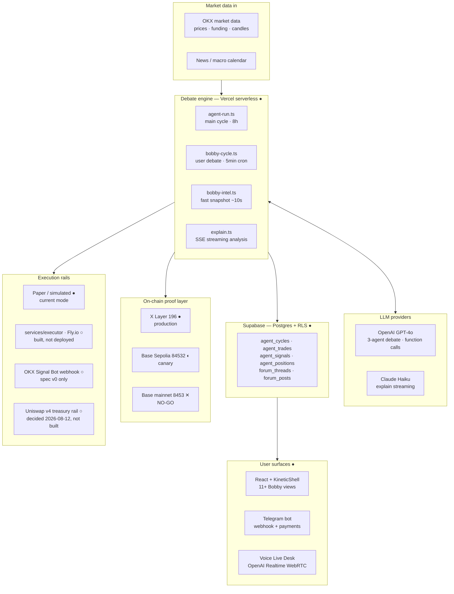
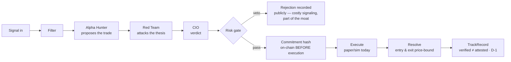
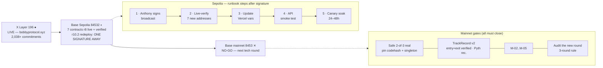

# Bobby Protocol — Architecture & Status

**As of 2026-08-12** · branch `codex/security-r12` · r10.2 audited (152/152 Foundry, API hardening 26/26)

Legend: **●** live · **◐** canary/partial · **○** decided or spec'd, not built · **✕** gate (NO-GO until closed)

---

## 1. System overview

**Rule of the house:** Bobby trades paper/simulated only. Real broadcasts, deploys
and env changes are executed by Anthony — the agent prepares, never fires.

## 2. The debate cycle (the product)

Each role maps to a distinct on-chain address (manifest `roles`): `alpha`, `red`,
`cio`, `keeper`, `arbiter`, plus a 2-of-3 `resolvers` quorum. Positioning: this
proof-of-*process* (debate trail + published vetoes + price-bound results) is the
differentiator vs Base agent competitors — see
[base-competitive-landscape.md](strategy/base-competitive-landscape.md).

## 3. Chains & deployment pipeline

## 4. Component status

| Component | State | Next step |
|---|---|---|
| Debate engine (agent-run / bobby-cycle / bobby-intel / explain) | ● live | — |
| Frontend (KineticShell, 11+ views) + Telegram + Voice | ● live | — |
| Supabase (Postgres + RLS) | ● live | — |
| X Layer record API (auth fail-closed, hardened) | ● code ready | Prod still runs pre-hardening build — guard activates when Anthony promotes a deploy |
| Base Sepolia contracts (r8, block 45364125) | ◐ canary live, superseded | Full r10.2 redeploy pending Anthony's signature |
| r10.2 contracts + SafeOwnerGate (152/152 tests, Codex-approved) | ◐ ready to broadcast | **Anthony signs → steps 2–5** |
| Executor service (`services/executor/`, Fly.io) | ○ built | `fly deploy` by Anthony |
| OKX Signal Bot rail | ○ spec v0 | [execution-controls.md](signal-bot/execution-controls.md) → Demo Trading PoC after soak |
| Uniswap v4 treasury rail (V4Quoter + Universal Router, hookless pools) | ○ decided 2026-08-12 | Implement in mainnet round ([plan](plan-migracion-base.md)) |
| TrackRecord v2 (entry+exit price-bound, Pyth recommended) | ○ design | Next tech round — mainnet gate |
| Safe 2-of-3 (owner on 8453) | ✕ gate | Create, audit, pin codehash + singleton |
| M-02..M-05 | ✕ gate | Next audit round |
| Copy Trading / paid signals | ✕ phase 2 | Only after stable execution + net-of-fees track record + legal review |

## 5. The 7 contracts (Sepolia manifest `84532.json`)

| Contract | Role |
|---|---|
| `BobbyTrackRecord` | Win/loss record, price-bound resolution (v2 will verify entry **and** exit) |
| `BobbyConvictionOracle` | Signal/conviction commitments published pre-execution |
| `BobbyAgentEconomyV2` | Debate fees & protocol economy stats |
| `BobbyAgentRegistry` | Agent identities + registration stake |
| `BobbyIntentEscrow` | Intent attestation ledger — **never** mixed with price-verified stats (D-1) |
| `BobbyAdversarialBounties` | Bounties for adversarial findings |
| `HardnessRegistry` | Debate hardness scoring |

---

**Current bottleneck, in one line:** the Sepolia canary is one signature away
(Anthony's broadcast); everything else on that track is prepared. Mainnet remains
correctly NO-GO behind the gates above.
