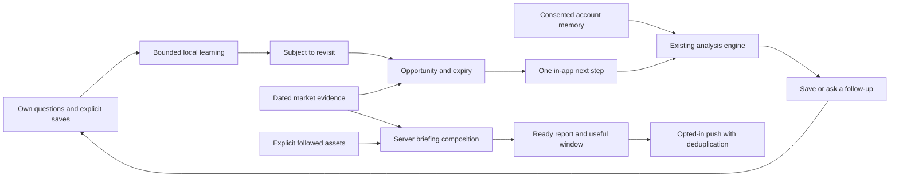

# Bobby: learning, analysis and useful timing

The product loop is: learn from an observed or explicit interest, connect that interest to sourced evidence, explain what the evidence means, offer one useful next step when the person can use it, and learn from the response. Micron is an example; asset selection is generic. Opening on Monday alone is not evidence that something changed.

Claude CLI contributed a conceptual design using the user's product description only. Repository code, private account data and credentials were excluded from that consultation. Implementation and code review were performed locally.

## Learning with an evidence boundary

The native harness retains bounded, account-separated actions on the device. Its versioned learning context distinguishes own questions, own threads, explicit follow-up requests, explicit saves, active theses and Bobby-authored reads. Bobby-authored reads, opened/picked chips and answered follow-ups do not increase inferred asset-interest scores. A contextual “Yes, tell me” records an optional request timestamp on the original Bobby-authored read without turning it into an own question. The global follow-up switch invents no asset choice. Responses can still teach the existing timing and interruption budget. Recency fades scores; at most five eligible subjects are returned. Future events and expired retained activity are excluded.

A save is a save, not an extra question. Existing saved-read pointer records remain readable without inflating question counts. The explicit next-day in-app choice continues to reopen the actual saved answer without a quote fetch, model call, credit charge or new presentation receipt.

The existing cloud memory summary records confirmed desk requests and explicit explanation preferences. It does not yet establish whether a request originated with the person or a Bobby suggestion. That history remains factual explanation context, and is not promoted to independently learned interest for server interruptions. Server opportunities require an explicitly followed asset. No holdings, wealth, investing skill or risk tolerance are inferred from these actions. The device ledger is not uploaded as an account profile.

## Analysis that is understandable and connected

The authenticated analysis handler turns the existing consented memory summary into `LearningContext` v1. Only the CIO receives that context. Alpha and Red Team evidence, model routing, plan checks, token budgets and the number of model calls stay unchanged. A beginner-friendly explanation is a presentation default; it is not stored or asserted as a discovered fact about the person. An explicitly chosen experience or risk-explanation depth controls presentation.

The CIO instruction connects one observable fact to its consequence and asks one clear follow-up question. It prohibits using memory to set verdict, direction, sufficiency, suitability or position size. This is an instruction in the existing CIO call, not a mechanically separate verdict stage or a guarantee of model invariance.

Native return offers distinguish three actions: reopen a saved historical answer; review an asset together when current evidence is absent; or examine a change when a positive, sourced, dated quote validates the comparison. Freshness uses provider time, never request time. Future, missing, stale and split-sized observations cannot produce a claimed change. The nudge revalidates at the tap and refreshes on source expiry while the screen remains open. A new analysis uses the existing explicit metered entry.

An explicitly followed Bobby-authored read says “Let's revisit” rather than claiming the person authored the question. Local scheduled follow-ups remain review invitations, not verified event alerts; their schedule alone is never presented as a fresh market fact.

## Timing and delivery

`LearningOpportunityV1` connects subject, interest origin, source date and expiry, measured novelty, explanation policy, next action, permitted channel and canonical delivery window. The existing briefing composer attaches it only with `BOBBY_LEARNING_OPPORTUNITIES_ENABLED=on`; the switch defaults off and grants no permission.

When enabled, the existing worker re-reads the published ready report after the database's existing paid-plan, consent, cadence, privacy and device-binding checks. It refuses missing, withdrawn, future, stale, unchanged, irrelevant, duplicate and out-of-window opportunities before decrypting a token. A successful storage read is required; storage failure means no send. Only the already opted-in weekly cadence is eligible for APNs in this rollout. Event metadata is in-app only; daily cadence metadata is never delivered. Explicit interests precede cloud request history when selecting sections for this rollout.

The source fact key is independent of translation and delivery period. An atomic reservation in the existing service-only idempotency table suppresses competing workers, and retained APNs-accepted outbox rows suppress later repeats. A reservation is not a delivery receipt. The policy deliberately sacrifices a delivery after a crash or uncertain reservation instead of risking a duplicate; APNs acceptance does not prove the person received or read it.

Weekly opportunities use dated historical closes and an actual source comparison. A 1% movement is an interruption filter, not a trading signal or a claim of financial significance. Canonical windows reuse the current NYSE calendar and daylight-saving calculations, checked against the [official hours and calendars](https://www.nyse.com/trade/hours-calendars). Unknown calendar coverage is silent.

## Delivery scope and remaining integration

The shipped asset-then-week planner keeps its strict historical volume benchmark across 4,000 generated ledgers. Optional sector plans use the current own-question/explicit-choice subjects, so they are checked against the interruption caps rather than the old all-Bobby-reads subject population. Both chains retain the 1,500-ledger cap suite and the 95 shared golden cases.

This is a review candidate stacked on reading continuity (PR #166) and the broader native harness (PR #164). It does not merge those pending native changes into production. The new server delivery policy has not been activated in production. No migration, live database write or real push send was performed for this change.

The weekly cadence composer and worker are wired. The accepted-source-change event evaluator is a pure future adapter contract: there is no live news ingestion, provider verification, polling, persisted event synthesis or event-driven worker here. Morning/close delivery also needs a verified source-refresh strategy within its useful window before adoption; prepared immutable quotes may expire before the scheduled send. Native and server opportunity types share concepts and presentation policy but are separate adapters, not a new cross-device profile sync. Server opportunity metadata remains internal to persisted report content; the existing public report DTO does not expose it.

The local in-app-only save choice is separate from the existing server weekly opt-in. Saving a reading does not enable or disable that independent setting, and no device is revoked. The new event contract cannot bypass this boundary to send a push; durable remote event-delivery consent must exist before adding such a path.

A read-only catalog check on the production Supabase project confirmed that the three existing delivery tables are present, use RLS, deny direct anon/authenticated SELECT, and retain the `(identity_id, scope, idem_key)` reservation key and compatible scope constraint. This is schema/access evidence, not a live reservation or delivery test.

Local validation covers source transport, memory gating, existing analysis execution, compose/publish/delivery with mocked providers/storage/APNs, concurrent-worker reservations, native persistence and rendering deadlines. It does not establish Android runtime, physical-iPhone behavior, real delivery, TestFlight distribution or production activation. Android changes in this candidate cover ledger/planner data and regression fixtures only; its native consent/UI adapter is not updated and no JVM runtime was available. Those are separate release checks.

## Candidate validation, 8 October 2026

- Production build passes with Node 24, including API TypeScript, source guard and public prerender.
- Learning-loop suite: 53 context, 10 real-handler mocked transport, 88 opportunity and 143 worker checks pass. The worker's PostgreSQL integration portion is skipped without DATABASE_URL.
- Existing regressions: 353 desk checks, 183 memory checks, 86 model-access checks and 165 briefing-content checks pass; the plain-desk snapshot passes 57 comparisons in 11 scenarios.
- iOS Debug simulator build and the full BobbyTests suite pass: 1,138 tests, zero failures, on the dedicated iPhone 17 Pro / iOS 26.1 simulator. The final source fingerprint matches the compiled source and golden fixtures. This includes 95 shared golden cases, 1,500 generated ledgers exercising both-chain caps and 4,000 shipped-chain comparisons against the historical planner.
- No physical iPhone, TestFlight, Android JVM, real APNs receipt or production rollout is claimed.
